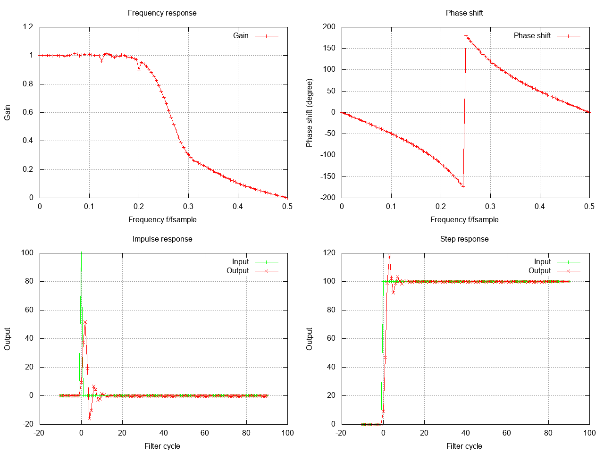

# Filter library for C

This repostitory contains a C-library that can be used to both design digital filters, as well as use them.

|  | 
|:--:| 
| *Example filter responses for a butterworth filter designed using this library.* |


<a name="examples"></a>The following filter types are supported:

| Name     |      Type     | Characteristics | Examples |
|----------|:-------------:|:-------------:|------------|
| Moving average | FIR     | lowpass, highpass | [Examples](doc/moving-average.md) |
| exponential    | FIR     | lowpass |
| exponential    | IIR     | lowpass | [Examples](doc/exponential.md)
| butterworth    | IIR     | lowpass, highpass, bandpass, bandstop | [Examples](doc/butterworth.md) |
| chebyshev (type 1)    | IIR     | lowpass, highpass, bandpass, bandstop | [Examples](doc/chebyshev.md) |
| chebyshev (type 2)    | IIR     | lowpass, highpass, bandpass, bandstop |  |
| brickwall    | FIR     | lowpass, highpass, bandpass, bandstop | [Examples](doc/brickwall.md) |

The filters are designed using the bilinear z-transform.
In broad terms, you start with the frequency response of the analog filter and compute its poles and zeros. These values are transformed via a bilinear z-transform and expanded into a polynomial. The polynomial is normalized for gain 1 at 0 or the middle of the pass band.
Here is a [Presentation](https://spinlab.wpi.edu/courses/ece503_2014/10-3bilinear_transform.pdf) explaining the process.

[MIT Signal processing continuous and discrete course](https://ocw.mit.edu/courses/2-161-signal-processing-continuous-and-discrete-fall-2008/pages/lecture-notes/)

## Usage example

```c
#include "dh/filter.h"

// create butterworth filter
dh_filter_data filter_data;
dh_filter_options opts;
opts.filter_type = DH_IIR_BUTTERWORTH_LOWPASS;
opts.parameters.butterworth.cutoff_frequency_hz = 25.0;
opts.parameters.butterworth.sampling_frequency_hz = 100.0;
opts.parameters.butterworth.filter_order = 5;
if ( dh_create_filter(&filter_data,&opts) != DH_FILTER_OK) {
    // handle error
}

// use filter
double input;
double output;
if(dh_filter(&filter_data, input,&output) != DH_FILTER_OK){
    // handle error
}

// free filter after you are done
dh_free_filter(&filter_data);

```

See also the examples: [Moving average](doc/moving-average.md), [Butterworth](doc/butterworth.md) and [Chebyshev](doc/chebyshev.md).


## Build and run

```bash
cmake -DDH_CFILTER_BUILD_EXAMPLES=ON \
      -DDH_CFILTER_BUILD_TESTS=ON \
      <path to src>
make
# run the unit tests
./test-filter
# use the example program to design a chebyshev bandstop
# -o: order 4
# -c: cutoff 15 hz and 35 Hz
# -s: sampling rate 100 Hz
# -r: ripple 3 dB
# -g: generate graphs
./design-filter -p chebyshev -t bandstop -o 4 -c 15,35 -s 100 -r -3 -g 
```

## License
All Code is licensed with the MIT license, see file "LICENSE"

