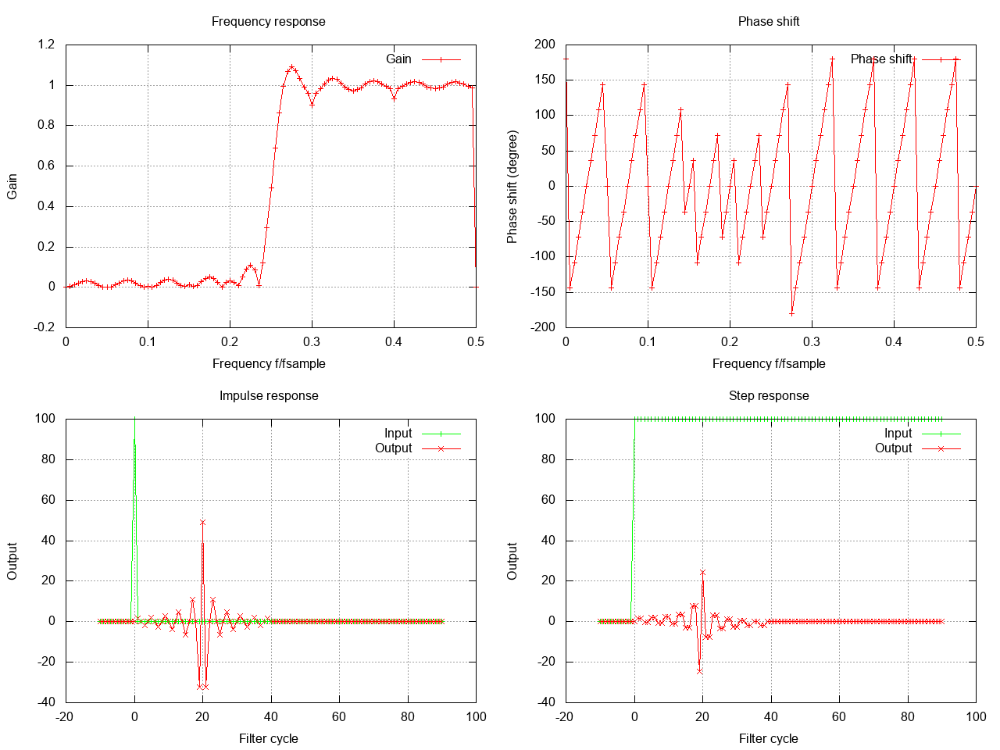
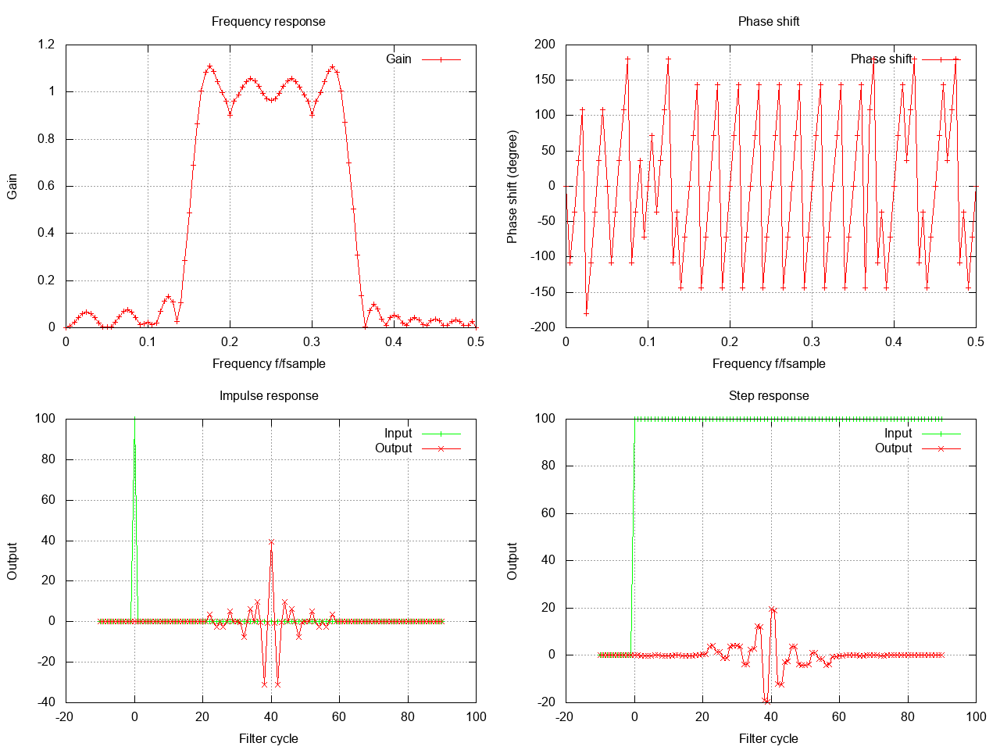
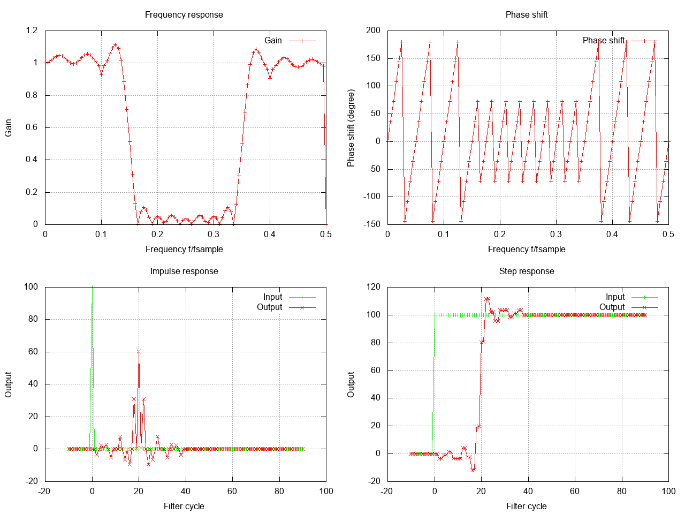

# Brickwall filters

Here are some examples of brickwall filters. These filters are finite impulse response filters. The frequency response will converge to a step function for increasing filter orders. However, these filters have a large delay.

# Lowpass

| Name             | Value          |
|------------------|----------------|
| Order            | 40              |
| Filter type        | 'lowpass'    |
| Sampling frequency | 100 Hz       |
| Cutoff 1           | 25 Hz        |


How to create this filter C:
```c
#include "dh/filter.h"

// create brickwall filter
dh_filter_data filter_data;
dh_filter_options opts;
opts.filter_type = DH_FIR_BRICKWALL_LOWPASS;
opts.parameters.brickwall.cutoff_frequency_hz = 25.0;
opts.parameters.brickwall.sampling_frequency_hz = 100.0;
opts.parameters.brickwall.filter_order = 40;
if ( dh_create_filter(&filter_data,&opts) != DH_FILTER_OK) {
    // handle error
}
```

# Highpass

| Name             | Value          |
|------------------|----------------|
| Order            | 40              |
| Filter type        | 'highpass'    |
| Sampling frequency | 100 Hz       |
| Cutoff 1           | 25 Hz        |



How to create this filter in code:
```c
#include "dh/filter.h"

// create brickwall filter
dh_filter_data filter_data;
dh_filter_options opts;
opts.filter_type = DH_FIR_BRICKWALL_HIGHPASS;
opts.parameters.brickwall.cutoff_frequency_hz = 25.0;
opts.parameters.brickwall.sampling_frequency_hz = 100.0;
opts.parameters.brickwall.filter_order = 40;
if ( dh_create_filter(&filter_data,&opts) != DH_FILTER_OK) {
    // handle error
}
```

# Bandpass

| Name             | Value          |
|------------------|----------------|
| Order            | 4              |
| Filter type        | 'bandpass'    |
| Sampling frequency | 100 Hz       |
| Cutoff 1           | 15 Hz        |
| Cutoff 2           | 35 Hz        |



How to create this filter in code:
```c
#include "dh/filter.h"

// create brickwall filter
dh_filter_data filter_data;
dh_filter_options opts;
opts.filter_type = DH_FIR_BRICKWALL_BANDPASS;
opts.parameters.brickwall.cutoff_frequency_hz = 15.0;
opts.parameters.brickwall.cutoff_frequency_2_hz = 35.0;
opts.parameters.brickwall.sampling_frequency_hz = 100.0;
opts.parameters.brickwall.filter_order = 40;
if ( dh_create_filter(&filter_data,&opts) != DH_FILTER_OK) {
    // handle error
}
```

# Bandstop

| Name             | Value          |
|------------------|----------------|
| Order            | 4              |
| Filter type        | 'bandstop'    |
| Sampling frequency | 100 Hz       |
| Cutoff 1           | 15 Hz        |
| Cutoff 2           | 35 Hz        |



How to create this filter in code:
```c
#include "dh/filter.h"

// create brickwall filter
dh_filter_data filter_data;
dh_filter_options opts;
opts.filter_type = DH_FIR_BRICKWALL_BANDSTOP;
opts.parameters.brickwall.cutoff_frequency_hz = 15.0;
opts.parameters.brickwall.cutoff_frequency_2_hz = 35.0;
opts.parameters.brickwall.sampling_frequency_hz = 100.0;
opts.parameters.brickwall.filter_order = 40;
if ( dh_create_filter(&filter_data,&opts) != DH_FILTER_OK) {
    // handle error
}
```
