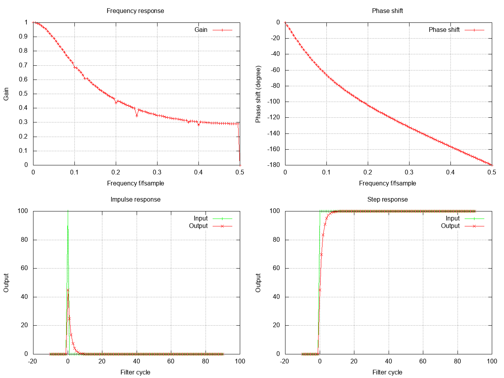

# Exponential filters

Exponential filters have an expopnential decay in the weights of the last inputs. These filters are IIR filters.

# Lowpass
For example, here is an exponential low pass:


How to create this filter in C code:
```c
#include "dh/filter.h"

// create an iir exponential filter
dh_filter_data filter_data;
dh_filter_options opts;
opts.filter_type = DH_IIR_EXPONENTIAL_LOWPASS;
opts.parameters.exponential.alpha = 0.15;
if ( dh_create_filter(&filter_data,&opts) != DH_FILTER_OK) {
    // handle error
}
```
