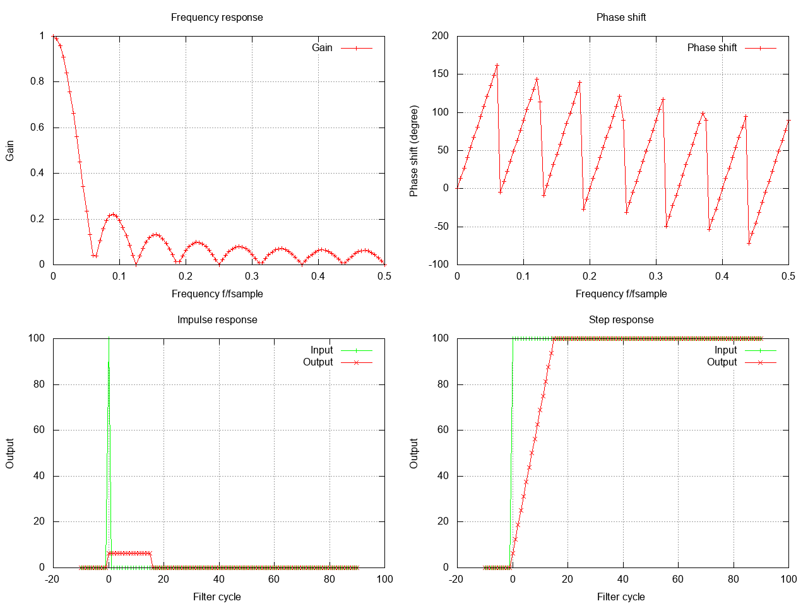
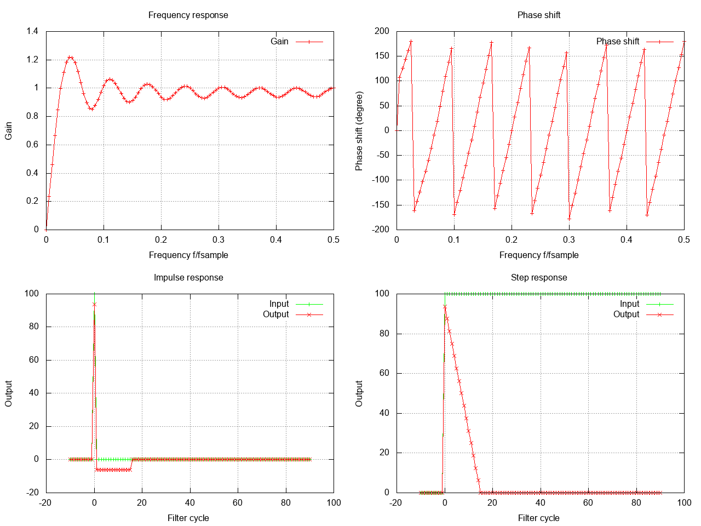

# Moving average filters

Moving average filters simply take the average of the last n inputs.

# Lowpass
For example, here is a 16 value moving average low pass:


How to create this filter in code:
```c
#include "dh/filter.h"

// create chebyshev filter
dh_filter_data filter_data;
dh_filter_options opts;
opts.filter_type = DH_FIR_MOVING_AVERAGE;
opts.parameters.moving_average.filter_order = 15;
if ( dh_create_filter(&filter_data,&opts) != DH_FILTER_OK) {
    // handle error
}
```

# Highpass
For example, here is a 16 value moving average high pass:


How to create this filter in code:
```c
#include "dh/filter.h"

// create chebyshev filter
dh_filter_data filter_data;
dh_filter_options opts;
opts.filter_type = DH_FIR_MOVING_AVERAGE_HIGHPASS;
opts.parameters.moving_average.filter_order = 15;
if ( dh_create_filter(&filter_data,&opts) != DH_FILTER_OK) {
    // handle error
}
```